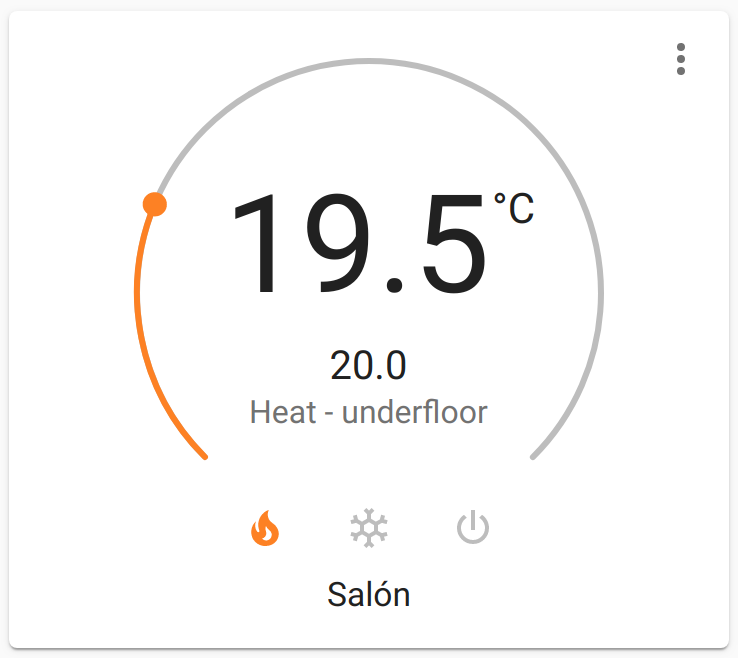
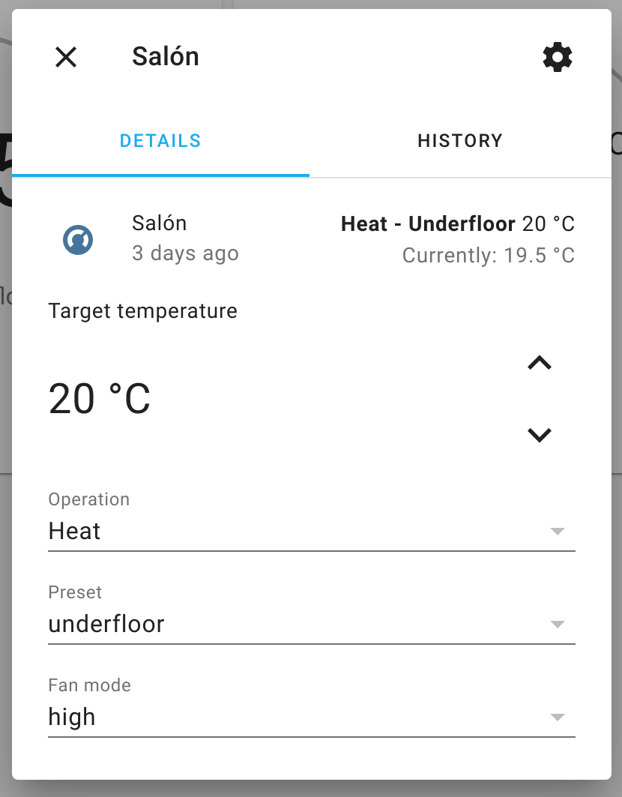
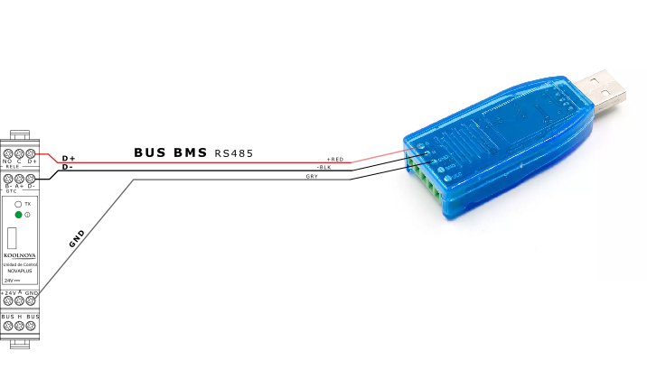

[](https://goreportcard.com/report/github.com/jpeletier/koolnova2mqtt)
[](https://pkg.go.dev/github.com/jpeletier/koolnova2mqtt)

# koolnova2mqtt bridge


***DISCLAIMER: This is not a Koolnova official product. Use at your own risk.***

**koolnova2mqtt** is a bidirectional bridge between MQTT and Koolnova's [100-CPND00](https://koolnova.com/catalogo/novaplus-domotica-100-cpnd00/) family of controllers, featuring auto-discovery for [Home Assistant](https://www.home-assistant.io), and compatible with [OpenHAB](https://www.openhab.org/) and any other automation platform that supports MQTT.

## Features

* Bi-directional synchronization between MQTT topics and Koolnova thermostats.
* Home Assistant auto-discovery as `climate` component thermostats and `sensor` reporting current temperature
* Written in go, cross-platform.

When connected, **koolnova2mqtt** reads all configuration parameters and exports to your MQTT server a topic structure and configuration parameters for Home Assistant. This allows to use thermostats and temperature sensor cards like this one:
 

Koolnova thermostat modes can be changed by entering the thermostat settings menu (three dots in the top right) and selecting various modes:



# Getting Started

## Requirements

* A Raspberry Pi or a PC 
* A RS4835 USB dongle, such as [this one](https://es.aliexpress.com/item/32978270588.html):

## Connecting

Wire the controller's D+ and D- ports as follows:



* Controller D+ to USB dongle A
* Controller D- to USB dongle B
* Controller GND to USB dongle GND

## Download

Check the [Releases](https://github.com/jpeletier/koolnova2mqtt/releases) page and download the appropriate binary for your platform.

## Running koolnova2mqtt

Before using `koolnova2mqtt`, test your connection with a tool such as [modpoll](https://www.modbusdriver.com/modpoll.html) to ensure your PC and controller can communicate. For example, the following command should return the controller's slave id (default 49):

```bash
./modpoll -b 9600 -p even -d 8 -s 1 -m rtu -t 4 -a 49 -1 -r 78 -4 100 /dev/ttyUSB0
```

Where:

* `-a 49` means send the message to slave with id `49`
* `-r 78` means read register #40078, which contains the slave ID
* `/dev/ttyUSB0` is the USB dongle's serial port. In Windows it would look like `COM3` or similar. Look in `/dev/ttyUSB*` or in Windows Device Manager to locate the port for your dongle.

Check [modpoll](https://www.modbusdriver.com/modpoll.html) documentation for further information.

## Command line reference
Once you are certain your dongle is properly connected, you can launch `koolnova2mqtt` with these parameters:

```
SYNTAX: 

koolnova2mqtt [options]

options:
  --clientid string
    	A clientid for the connection (default "your hostname")
  --hassPrefix string
    	Home assistant discovery prefix (default "homeassistant")
  --modbusDataBits int
    	Modbus port data bits (default 8)
  --modbusParity string
    	N - None, E - Even, O - Odd (default E) (The use of no parity requires 2 stop bits.) (default "E")
  --modbusPort string
    	Serial port where modbus hardware is connected (default "/dev/ttyUSB0")
  --modbusRate int
    	Modbus port data rate (default 9600)
  --modbusSlaveIDs string
    	Comma-separated list of modbus slave IDs to manage (default "49")
  --modbusSlaveNames string
    	Comma-separated list of modbus slave names. Defaults to 'slave#'
  --modbusStopBits int
    	Modbus port stop bits (default 1)
  --password string
    	Password to match MQTT username
  --prefix string
    	MQTT topic root where to publish/read topics (default "koolnova2mqtt")
  --server string
    	The full url of the MQTT server to connect to ex: tcp://127.0.0.1:1883 (default "tcp://127.0.0.1:1883")
  --username string
    	A username to authenticate to the MQTT server
```

### Example:

```
koolnova2mqtt --server tcp://192.168.1.1:1883 --modbusPort '/dev/ttyUSB1' --modbusSlaveIDs '49,50' --modbusSlaveNames 'firstFloor,secondFloor'
```

## MQTT topic structure

The generated structure in MQTT looks as follows:

```
koolnova2mqtt
└── firstFloor
    ├── zone1
    │   ├── fanMode = auto
    │   ├── targetTemp = 20.5
    │   ├── currentTemp = 21
    │   └── hvacMode = heat
    ├── zone2
    │   ├── fanMode = low
    │   ├── targetTemp = 21
    │   ├── currentTemp = 20
    │   └── hvacMode = heat
    ├── zone3
    │   ├── fanMode = auto
    │   ├── targetTemp = 21
    │   ├── currentTemp = 21.5
    │   └── hvacMode = heat
    └── sys
        ├── ac1
        │   ├── airflow = 0
        │   ├── targetTemp = 0
        │   └── fanMode = high
        ├── ac2
        │   ├── airflow = 0
        │   ├── targetTemp = 0
        │   └── fanMode = high
        ├── ac3
        │   ├── airflow = 0
        │   ├── targetTemp = 0
        │   └── fanMode = high
        ├── ac4
        │   ├── airflow = 0
        │   ├── targetTemp = 0
        │   └── fanMode = high
        ├── efficiency = 3
        ├── enabled = true
        ├── serialBaud = 9600
        ├── serialParity = even
        └── holdMode = underfloor and fan

```
Most of the topics have a child `set` topic that allow you to modify that value. Thus, to change the target temperature of zone2 to 20.5ºC, write the string `20.5` to `koolnova2mqtt/firstFloor/zone2/targetTemp/set` topic. With the tool `mosquitto_pub`:

```bash
mosquitto_pub -t "koolnova2mqtt/firstFloor/zone2/targetTemp/set" -m "20.5"
```

If the operation is successful, the topic `"koolnova2mqtt/firstFloor/zone2/targetTemp"` (without `set`) will be updated with the new target temperature, and the thermostat will show the new value.

## Author(s)

This package is written and maintained by Javier Peletier ([@jpeletier](https://github.com/jpeletier))